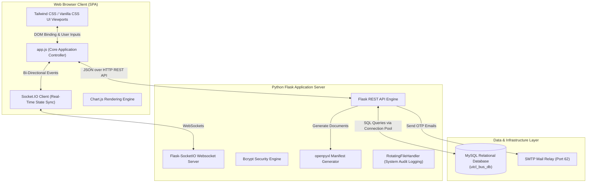
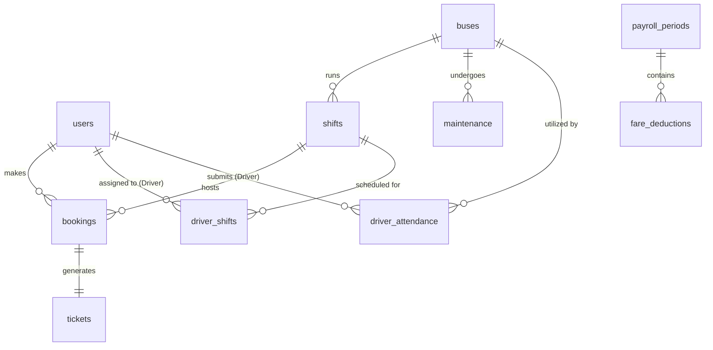
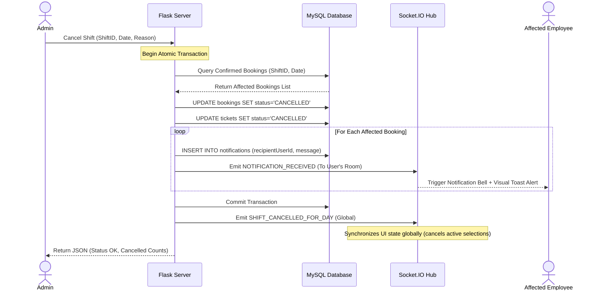

# UTCL Bus Management System: System Blueprint & Technical Specification

This document provides a comprehensive technical blueprint of the **UTCL (UltraTech Cement Limited) Bus Management System**. It outlines the application's high-level architecture, relational database schema, Flask API endpoints, real-time WebSocket protocol, frontend UI frameworks, and enterprise deployment options.

---

## 1. System Overview & Scope

The UTCL Bus Management System is an enterprise Single Page Application (SPA) designed to manage corporate transit operations. It schedules, books, coordinates, and audits commutes across **2 physical buses** performing **8 daily shifts** (4 forward, 4 return trips) on a fixed bidirectional route between **Awalpur** and **Chandrapur** via 5 intermediate stops.

### Core Portals (Role-Based Access Control)
1. **Admin Portal**: Fleet scheduling, driver assignments, real-time tracking, maintenance coordination, payroll audits, monthly fare deduction reporting, and emergency shift cancellations.
2. **Employee (Passenger) Portal**: Route schedules, seat maps (40-seat grid), booking history, passenger profile updates, and virtual ticket generation with active barcode rendering.
3. **Driver Portal**: Personal duty roster, route timeline tracker, maintenance alerts, and double-photo shift attendance logs (departure + arrival camera scans).

---

## 2. High-Level System Architecture

The application is structured as a client-server architecture with state synchronization powered by WebSockets to ensure real-time consistency.



### Key Architectural Characteristics:
*   **Zero-Page-Reload Experience**: The frontend operates as a single HTML document (`index.html`) using local JavaScript routers. Layout transitions are dynamically handled using DOM class manipulations.
*   **WebSockets Core State Engine**: Every administrative, booking, and attendance action is broadcast instantly to connected clients. If a seat is held, a booking is made, or a shift is cancelled, the state reflects on all active monitors without manual refreshing.
*   **Threaded MySQL Connection Pooling**: The server utilizes a `mysql.connector.pooling` layout containing a pool size of 32 threads, guaranteeing fast query responses, preventing pool exhaustion under load, and implementing automatic fallback rules.

---

## 3. Database Schema Blueprint

The MySQL database (`utcl_bus_db`) contains 13 relational tables mapping the system's operational entities. All schema mutations are executed automatically on server startup.



### Table Definitions & Column Metadata

#### 1. `users` (User Registry & Credentials)
Stores employee profiles, roles, encrypted passwords, and plant affiliations.
*   `id` [VARCHAR(50), PK]: Unique user ID.
*   `name` [VARCHAR(100)]: Full legal name of the employee.
*   `psNumber` [VARCHAR(50), UNIQUE]: Unique UTCL Personnel Search (PS) identifier.
*   `password` [VARCHAR(100)]: Encrypted password string (hashed using `bcrypt`).
*   `role` [VARCHAR(20)]: Access level (`ADMIN`, `EMPLOYEE`, `DRIVER`).
*   `isActive` [BOOLEAN]: Flag indicating if account is active.
*   `email` [VARCHAR(100), NULL]: Corporate email address.
*   `phone` [VARCHAR(20), NULL]: Contact number.
*   `plant` [VARCHAR(50)]: Work site location (default: `'Awalpur'`).

#### 2. `buses` (Fleet Inventory)
*   `id` [VARCHAR(50), PK]: Unique bus ID.
*   `identifier` [VARCHAR(50)]: Public identifier label (e.g. `'Bus 1'`, `'Bus 2'`).
*   `isActive` [BOOLEAN]: Availability status.

#### 3. `shifts` (Static Shift Schedules)
*   `id` [VARCHAR(50), PK]: Shift unique ID (e.g. `'S1F'`, `'S1R'`).
*   `busId` [VARCHAR(50), FK]: Reference to `buses.id`.
*   `direction` [VARCHAR(20)]: Route direction (`FORWARD` or `RETURN`).
*   `departureTime` [VARCHAR(20)]: Scheduled time of origin departure.
*   `isActive` [BOOLEAN]: Shift scheduling status.
*   `stops` [JSON]: Ordered array of stops: `[{"index": 0, "name": "Awalpur", "arrival": "05:30 AM"}, ...]`

#### 4. `driver_shifts` (Driver Roster Schedules)
*   `id` [VARCHAR(50), PK]: Roster record ID.
*   `driverId` [VARCHAR(50), FK]: Reference to `users.id` (Driver).
*   `shiftId` [VARCHAR(50), FK]: Reference to `shifts.id`.
*   `date` [VARCHAR(20)]: Roster calendar date (`YYYY-MM-DD`).

#### 5. `driver_attendance` (Driver Clock-In/Out Registry)
Stores driver clock-ins complete with URL links to uploaded verification photos.
*   `id` [VARCHAR(50), PK]: Attendance entry ID.
*   `driverId` [VARCHAR(50), FK]: Reference to `users.id` (Driver).
*   `busId` [VARCHAR(50), FK]: Reference to `buses.id`.
*   `shiftId` [VARCHAR(50), FK]: Reference to `shifts.id`.
*   `date` [VARCHAR(20)]: Travel date.
*   `departurePhotoUrl` [TEXT]: Path to clock-in selfie image.
*   `departureTime` [VARCHAR(50)]: Timestamp of departure verification.
*   `arrivalPhotoUrl` [TEXT]: Path to clock-out selfie image.
*   `arrivalTime` [VARCHAR(50)]: Timestamp of arrival verification.
*   `status` [VARCHAR(20)]: Current verification state (`PENDING`, `APPROVED`, `REJECTED`).

#### 6. `maintenance` (Fleet Servicing Logs)
*   `id` [VARCHAR(50), PK]: Log ID.
*   `busId` [VARCHAR(50), FK]: Reference to `buses.id`.
*   `scheduledDate` [VARCHAR(20)]: Proposed maintenance date.
*   `description` [TEXT]: Scope of work description (e.g. brake pads, engine tune-up).
*   `status` [VARCHAR(20)]: Status of maintenance (`SCHEDULED`, `COMPLETED`, `OVERDUE`).
*   `actualCompletionDate` [VARCHAR(20), NULL]: Date maintenance was marked completed.

#### 7. `tracking` (Live Vehicle Locations)
*   `busId` [VARCHAR(50), PK, FK]: Reference to `buses.id`.
*   `operationalStatus` [VARCHAR(50)]: Operational status (`ACTIVE`, `IDLE`, `UNDER_MAINTENANCE`).
*   `currentShiftId` [VARCHAR(50), NULL]: Reference to `shifts.id` when in transit.
*   `currentStopIndex` [INT, NULL]: Last scanned route stop index (0 to 6).
*   `lastUpdated` [VARCHAR(50)]: ISO 8601 update timestamp.

#### 8. `notifications` (In-App Passenger Message Center)
*   `id` [VARCHAR(50), PK]: Notification message ID.
*   `recipientUserId` [VARCHAR(50), FK]: Reference to `users.id`.
*   `message` [TEXT]: Notification context body.
*   `isRead` [BOOLEAN]: Read indicator status.
*   `createdAt` [VARCHAR(50)]: Normalised UTC timestamp (`YYYY-MM-DDTHH:MM:SSZ`).

#### 9. `bookings` (Passenger Booking Ledgers)
*   `id` [VARCHAR(100), PK]: Booking ID.
*   `shiftId` [VARCHAR(50), FK]: Reference to `shifts.id`.
*   `psNumber` [VARCHAR(50)]: Personnel Search Number of passenger.
*   `employeeName` [VARCHAR(100)]: Passenger full name.
*   `seatNumber` [VARCHAR(100)]: Selected seat identifier (allows single seat or multiple separated by commas).
*   `boardingStopIndex` [INT]: Index of departure boarding point.
*   `dropStopIndex` [INT]: Index of drop-off stop.
*   `fareAmount` [INT]: Cost charged (Flat ₹20 per booking or per seat booked).
*   `status` [VARCHAR(20)]: Ticket status (`CONFIRMED`, `CANCELLED`).
*   `travelDate` [VARCHAR(20)]: Planned travel date (`YYYY-MM-DD`).
*   `bookedAt` [VARCHAR(50)]: Timestamp of booking creation.
*   `cancelledAt` [VARCHAR(50), NULL]: Cancellation timestamp (if applicable).

#### 10. `tickets` (Printable Virtual Boarding Passes)
*   `id` [VARCHAR(100), PK]: Ticket ID.
*   `bookingId` [VARCHAR(100), FK]: Reference to `bookings.id`.
*   `ticketNumber` [VARCHAR(50), UNIQUE]: Unique serial code (e.g. `'UTCL-19284'`).
*   `employeeName` [VARCHAR(100)]: Passenger name.
*   `psNumber` [VARCHAR(50)]: Passenger PS number.
*   `shiftCode` [VARCHAR(50)]: Assigned shift.
*   `seatNumber` [VARCHAR(100)]: Assigned seat number.
*   `boardingStop` [VARCHAR(100)]: Departure stop name.
*   `dropStop` [VARCHAR(100)]: Arrival stop name.
*   `fare` [INT]: Ticket fare (₹20).
*   `departureTime` [VARCHAR(20)]: Scheduled departure time.
*   `travelDate` [VARCHAR(20)]: Travel date.
*   `generatedAt` [VARCHAR(50)]: ISO time representation of pass generation.
*   `status` [VARCHAR(20)]: Ticket operational status (`ACTIVE`, `CANCELLED`).

#### 11. `payroll_periods` (Monthly Payroll Cycles)
*   `id` [VARCHAR(50), PK]: Period identifier (e.g. `'payroll_2026-06'`).
*   `periodMonth` [VARCHAR(10)]: Target month (`YYYY-MM`).
*   `totalAmount` [DECIMAL(10,2)]: Total fare deduction collected.
*   `employeeCount` [INT]: Number of unique employees billed.
*   `status` [VARCHAR(20)]: Payroll state (`DRAFT`, `PROCESSED`, `LOCKED`).
*   `generatedAt` [VARCHAR(50)]: Draft timestamp.
*   `processedAt` [VARCHAR(50), NULL]: Processed time.
*   `processedBy` [VARCHAR(50), NULL]: Reference to Admin `users.id`.
*   `notes` [TEXT, NULL]: Optional remarks.

#### 12. `fare_deductions` (Employee Billed Rides Details)
*   `id` [VARCHAR(50), PK]: Deduction record ID.
*   `periodId` [VARCHAR(50), FK]: Reference to `payroll_periods.id`.
*   `periodMonth` [VARCHAR(10)]: Billed month (`YYYY-MM`).
*   `psNumber` [VARCHAR(50)]: Employee PS identifier.
*   `employeeName` [VARCHAR(100)]: Employee name.
*   `role` [VARCHAR(20)]: Employee role classification.
*   `totalRides` [INT]: Number of completed rides within the cycle.
*   `totalAmount` [DECIMAL(10,2)]: Total deduction amount (`totalRides * ₹20`).
*   `status` [VARCHAR(20)]: Deduction status (`PENDING`, `SUBMITTED`).

#### 13. `password_reset_tokens` (Auth Token Storage)
*   `id` [VARCHAR(50), PK]: Token unique ID.
*   `psNumber` [VARCHAR(50)]: Reference user PS number.
*   `token` [VARCHAR(6)]: 6-digit verification code.
*   `expiresAt` [DATETIME]: Expiration timestamp.
*   `used` [BOOLEAN]: Token status.

---

## 4. API Endpoint Registry

The backend REST API handles all state read/write operations and reports. 

| Category | HTTP Method | Endpoint | Description |
|---|---|---|---|
| **Authentication** | `POST` | `/api/auth/login` | Authenticate credentials and establish session context. |
| | `POST` | `/api/auth/forgot-password` | Generate 6-digit password OTP sent via SMTP relay. |
| | `POST` | `/api/auth/verify-otp` | Verify validity of 6-digit reset token. |
| | `POST` | `/api/auth/reset-password` | Set new password with active OTP token validation. |
| | `POST` | `/api/auth/change-password` | Set new password from active profile page context. |
| **Global Sync** | `POST` | `/api/sync` | Fetch bulk database table entries in single request. |
| | `GET` | `/api/db-status` | Diagnostic endpoint validating database connectivity. |
| | `GET` | `/api/data` | Retrieve active schedules and locations. |
| **Employee Services** | `GET` | `/api/employees/search` | Dynamic lookup of registered employees by name/PS. |
| | `POST` | `/api/booking/create` | Atomic verification, seat check, and booking reservation. |
| | `POST` | `/api/booking/cancel/<id>` | Cancel booking and release seat globally. |
| | `GET` | `/api/bookings/export` | Export passenger booking history to Excel format. |
| **Driver Portal** | `GET` | `/api/driver/attendance/status` | Fetch driver schedule attendance validation status. |
| | `POST` | `/api/driver/attendance/submit-departure` | Submit clock-in selfie verification photo. |
| | `POST` | `/api/driver/attendance/submit-arrival` | Submit clock-out selfie verification photo. |
| **Admin Operations** | `PATCH` | `/api/admin/attendance/<id>` | Approve or reject driver attendance. |
| | `GET` | `/api/admin/attendance/pending` | Fetch pending driver attendance requests. |
| | `GET` | `/api/admin/attendance/history` | Historical driver attendance listings. |
| | `GET` | `/api/admin/attendance/history/export` | Export historical attendance to spreadsheet. |
| | `GET` | `/api/admin/shifts/booking-count` | Fetch real-time count of bookings on a date + shift. |
| | `POST` | `/api/admin/shifts/cancel-for-day` | Bulk cancel shift for a day, refund, and notify users. |
| | `GET` | `/api/admin/shifts/<id>/export-manifest` | Generate physical printable passenger manifest. |
| | `POST` | `/api/admin/reset-user-password` | Administrative reset of user account password. |
| **Payroll Services** | `GET` | `/api/payroll/summary` | Fetch draft payroll summaries for open months. |
| | `POST` | `/api/payroll/generate` | Aggregate confirmed bookings to generate a draft payroll. |
| | `GET` | `/api/payroll/periods` | Retrieve payroll cycles history. |
| | `GET` | `/api/payroll/period/<id>` | Fetch detailed list of employee deductions for period. |
| | `PATCH` | `/api/payroll/period/<id>/mark-processed` | Commit draft payroll cycle and transition to processed. |
| | `PATCH` | `/api/payroll/period/<id>/unlock` | Revert committed payroll to draft for modifications. |
| | `GET` | `/api/payroll/period/<id>/export` | Generate monthly payroll spreadsheet for Excel export. |
| | `GET` | `/api/payroll/my-fares` | Fetch user-specific ride deductions list. |

---

## 5. WebSocket Event Protocol

WebSockets maintain real-time visual synchronisation between all active portal clients.

### Server Incoming Listeners

1.  **`register_user`**: Maps client connection ID to a target room.
    *   *Payload*: `{"userId": "u1", "role": "ADMIN", "psNumber": "PS00001"}`
    *   *Effect*: Backend adds the socket connection to target rooms: individual `userId` room, role room (e.g. `all_employees`), and global channel.
2.  **`join_seat_room`**: Connects employee client to specific schedule seat layout room.
    *   *Payload*: `{"shiftId": "S1F", "date": "2026-06-22"}`
3.  **`select_seat`**: Temporary seat lock trigger during seat booking grid selection.
    *   *Payload*: `{"shiftId": "S1F", "date": "2026-06-22", "seatNumber": "15", "userId": "u2"}`
    *   *Effect*: Broadcasts `seat_held` lock notification to all passengers viewing this map.
4.  **`deselect_seat`**: Releases temporary seat lock.
    *   *Payload*: `{"shiftId": "S1F", "date": "2026-06-22", "seatNumber": "15", "userId": "u2"}`
    *   *Effect*: Broadcasts `seat_released` release notification to seat layout room.

---

### Server Outgoing Events (Emits)

| Event Name | Scope / Recipient | Payload | Trigger Event / Effect |
|---|---|---|---|
| `seat_held` | Seat Layout Room | `{"seatNumber": "15", "userId": "u2"}` | Lock seat color grey/yellow in other users' maps. |
| `seat_released` | Seat Layout Room | `{"seatNumber": "15"}` | Return seat layout grid square to clickable green state. |
| `seat_booked` | Seat Layout Room | `{"seatNumber": "15"}` | Set seat grid square status to permanent red (Occupied). |
| `SEAT_COUNT_UPDATED` | Global Channel | `{"shiftId": "S1F", "count": 22}` | Decrements available seat metrics on schedule panels. |
| `SHIFT_LOCKED` | Global Channel | `{"shiftId": "S1F"}` | Locks shift booking options when departure window closes. |
| `TRACKING_UPDATED` | Global Channel | `{"table": "tracking"}` | Updates active position coordinates of buses on map views. |
| `NEW_NOTIFICATION` | Target User Room | `{"id": "n1", "message": "..."}` | Increments notifications counter badge in user header. |
| `NOTIFICATION_RECEIVED` | Target User Room | `{"id": "n1", "message": "..."}` | Pops up an immediate toast banner on client interface. |
| `SHIFT_CANCELLED_FOR_DAY` | Global Channel | `{"shiftId": "S1F", "date": "..."}` | Automatically updates frontend schedules and views. |
| `ATTENDANCE_UPDATED` | Global Channel | `{"table": "attendance"}` | Refreshes Admin pending/verified lists. |
| `PAYROLL_UPDATED` | Global Channel | `{"table": "payroll"}` | Updates active payroll statistics and ledger lists. |

---

## 6. Key Workflows & State Diagrams

### A. Employee Ticket Booking Workflow

```
[Schedule Selector]
         │
         ▼
[Stops & Details Verification] ──► Validate Boarding Stop Precedes Drop Stop
         │
         ▼
[Seat Selection Grid] ──────────► Verify Seat Availability (Active Lock Checks)
         │
         ▼
[Confirm Booking (Flat ₹20)] ───► Database Check: Avoid Duplicate Shifts
         │
         ├───► Fail: Release Holds, Show Error Banner
         │
         ▼
[Success: Ticket Generation] ───► Generate Barcode, Add to My Tickets,
                                  Emit "seat_booked" & "SEAT_COUNT_UPDATED"
```

### B. Shift Cancellation & Refund Workflow
When an Admin cancels a scheduled shift for a specific day due to vehicle breakdown, weather, or maintenance, the system automates a cascade of database operations:



---

## 7. Branding & Aesthetic System

The frontend dashboard adheres strictly to the **UTCL (UltraTech Cement Limited) Corporate Brand Identity Guidelines**.

### Design System Configuration:

*   **Color Palette**:
    *   **Primary Background**: Light Cream (`#FCFBF9`) — provides a premium, clean editorial backdrop.
    *   **Primary Corporate Grey**: `#58595B` (Header backgrounds, side panels, and primary text).
    *   **Corporate Accent Yellow**: `#FBB040` (Borders, selected highlights, primary buttons).
    *   **Corporate Accent Blue**: `#0057A8` (Links, informational badges, confirmation cards).
    *   **Status Color Rules**:
        *   *Success (Available/Approved)*: Emerald Green (`#10B981`).
        *   *Warning (Held/Pending/Low Occupancy)*: Amber Orange (`#F59E0B`).
        *   *Danger (Occupied/Cancelled/High Occupancy)*: Crimson Red (`#EF4444`).
*   **Typography**:
    *   Primary headers use **Outfit** (geometric sans-serif typeface matching UTCL's logo aesthetic).
    *   Body text and table analytics use **Inter** (highly readable sans-serif).
*   **Interactive Components Layouts**:
    *   **Integrated Summary Card**: A clean, compact data overview (`bg-slate-50 border border-slate-100 rounded-xl my-4 p-4 flex flex-col gap-2`) displaying metrics side-by-side rather than stacked. Used in modals (e.g. cancel shift impacts) to avoid breaking form flows.
    *   **Interactive Seat Grid**: Responsive grid system styling available seats in light green with hover popups, occupied seats in solid light red, and held seats in yellow.

---

## 8. Deployment Architecture Options

### Option A: Dockerised Setup (Recommended for Cloud Hosting)
Maintains isolation by running the Python server and MySQL backend inside separate containers, orchestrated using Docker Compose.

```yaml
# docker-compose.yml
version: '3.8'
services:
  db:
    image: mysql:8.0
    container_name: utcl_mysql
    restart: always
    environment:
      MYSQL_ROOT_PASSWORD: SecureRootPassword
      MYSQL_DATABASE: utcl_bus_db
    ports:
      - "3306:3306"
    volumes:
      - mysql_data:/var/lib/mysql

  web:
    build: .
    container_name: utcl_web
    restart: always
    ports:
      - "80:8000"
    depends_on:
      - db
    environment:
      DB_HOST: db
```

### Option B: Local Office Intranet Deployment (Windows Server Setup)
For hosting within a physical plant local area network (LAN):
1.  **Engine**: Run Python via Virtual Environment (`.venv`).
2.  **Windows Service**: Use **NSSM** (Non-Sucking Service Manager) to wrap `server.py` execution into a Windows Service:
    ```cmd
    nssm install UTCLBusServer "C:\UTCL-Bus-System\.venv\Scripts\python.exe" "server.py"
    nssm set UTCLBusServer AppDirectory "C:\UTCL-Bus-System"
    nssm set UTCLBusServer Start SERVICE_AUTO_START
    ```
3.  **Firewall Rules**: Open Port `8000` on the host to allow internal corporate LAN connections.

### Option C: High-Availability Cloud Setup (Linux VPS + Nginx + Gunicorn)
Provides security and scalability on a public Linux VPS:
*   **WSGI Server**: Gunicorn running 3 worker processes (`gunicorn --workers 3 --bind 127.0.0.1:8000 server:app`).
*   **Process Manager**: Managed via Systemd service unit (`utcl.service`).
*   **Reverse Proxy**: Nginx forwarding external traffic (port 80/443 SSL) to internal Gunicorn (port 8000) with websocket upgrade headers:
    ```nginx
    location /socket.io {
        include proxy_params;
        proxy_http_version 1.1;
        proxy_buffering off;
        proxy_set_header Upgrade $http_upgrade;
        proxy_set_header Connection "Upgrade";
        proxy_pass http://127.0.0.1:8000/socket.io;
    }
    ```
