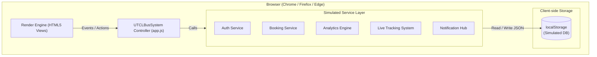

# Design Document: UTCL Bus Management System (SPA Version)

## Overview

The UTCL Bus Management System is a client-side web application for Ultratech Cement Ltd employees. It manages 2 physical buses operating on daily scheduled shifts along a fixed bidirectional route (Awalpur ↔ Chandrapur via 5 intermediate stops). The system exposes three role-based portals — Admin, Employee, and Driver — each with distinct capabilities.

**Core responsibilities:**
- Employee ticket booking with PS Number verification, seat selection, and virtual ticket generation
- Driver dashboard showing assigned shifts and upcoming maintenance
- Admin portal for fleet management, schedule configuration, revenue analytics, occupancy analysis, and bus tracking
- Flat fare of ₹20 per booking regardless of boarding/drop stop
- Session management with 30-minute inactivity timeout
- UTCL corporate branding (light cream background, signature yellow highlights, black outline borders)

**Fixed Route (ordered stops):**

| Index | Stop Name   |
|-------|-------------|
| 0     | Awalpur     |
| 1     | Bibee       |
| 2     | Gadchandur  |
| 3     | Manikgarh   |
| 4     | Rajura      |
| 5     | Ballarsha   |
| 6     | Chandrapur  |

**Daily Shifts (8 trips total — 4 forward, 4 return):**

| Shift ID | Friendly Label | Bus | Direction | Departure |
|----------|----------------|-----|-----------|-----------|
| S1F | Bus 1 - Forward | Bus 1 | Forward (Awalpur→Chandrapur) | 05:30 AM |
| S1R | Bus 1 - Return  | Bus 1 | Return (Chandrapur→Awalpur)  | 08:00 AM |
| S2F | Bus 2 - Forward | Bus 2 | Forward | 08:30 AM |
| S2R | Bus 2 - Return  | Bus 2 | Return  | 12:30 PM |
| S3F | Bus 3 - Forward | Bus 1 | Forward | 10:30 AM |
| S3R | Bus 3 - Return  | Bus 1 | Return  | 03:30 PM |
| S4F | Bus 4 - Forward | Bus 2 | Forward | 03:00 PM |
| S4R | Bus 4 - Return  | Bus 2 | Return  | 07:00 PM |

---

## Architecture

### High-Level Architecture

The system runs entirely in the browser as a zero-dependency Single Page Application (SPA). The server layer, database layer, and caching layer are simulated client-side inside a cohesive service structure.



### Architectural Decisions

- **Client-Side SPA Architecture**: Implemented as a single HTML page (`index.html`) with dynamic view toggling to guarantee zero configuration, rapid loading, and instant deployment without Node.js or Docker.
- **Simulated Relational Database**: Implemented in-memory structures persisted inside the browser's `localStorage` to replicate tables like `User`, `Bus`, `Booking`, and `Maintenance` with full relational consistency.
- **Chart.js via CDN**: Utilized Chart.js to render professional-grade charts (KPI breakdowns, weekday vs. weekend occupancy averages, and 365-day line trends) directly on Canvas elements.
- **In-Memory Session Lifecycle**: Simulates Redis session TTL using an interval loop checking elapsed milliseconds against user activity timestamps in `localStorage`.

---

## Technology Stack

| Layer | Technology | Rationale |
|-------|-----------|-----------|
| Frontend | HTML5 + JavaScript (ES6) | Native browser compatibility; zero-build overhead |
| Styling | Custom Vanilla CSS3 | UltraTech corporate branding with light cream theme, outline buttons, and animations |
| Charts | Chart.js (CDN) | Lightweight, canvas-based charting for revenue/occupancy dashboards |
| Local Storage | Web Storage API (`localStorage`) | Preserves database state across page refreshes and browser sessions |
| Server Simulation | Python `http.server` | Lightweight, native serving of static files |
| Fonts | Google Fonts (Outfit & Inter) | Matches modern brand aesthetics |

---

## Components and Interfaces

### Frontend Component Tree

```
App (UTCLBusSystem)
├── RenderEngine (dynamic panel display controller)
├── AuthGuard (forces login redirect on session expiry)
├── AdminPortal (Admin view container)
│   ├── AdminDashboard (Alerts, Active Fleet KPI, Bookings Count)
│   ├── UserManagement (CRUD user list, deactivator)
│   ├── BusDriverAssign (Add bus, driver assignment form)
│   ├── ModifyShifts (Dropdown selector, stop times modifier form)
│   ├── MaintenanceLogs (Servicing scheduler, completed toggle)
│   ├── RevenueAnalytics (Date filters, KPI stats cards, Chart.js breakdown)
│   ├── OccupancyAnalysis (Weekday/Weekend comparison bar chart, historical trend)
│   └── BusTracking (Live location stop timeline, animated bus badges)
├── EmployeePortal (Employee view container)
│   ├── BookingFlow
│   │   ├── Step 1: Schedule Selector (Filter available shifts today/future)
│   │   ├── Step 2: Stops & Details (Boarding/drop order, PS verification)
│   │   ├── Step 3: Seat Map (40-grid interactive layout)
│   │   └── Step 4: Booking Summary (Flat ₹20 fare confirmation)
│   ├── VirtualTicket (Boarding pass graphic card with barcode print layout)
│   ├── BookingHistory (Retrieve bookings by PS#, label Active/Past)
│   └── ShiftSchedules (Static grid of stop timings)
└── DriverPortal (Driver view container)
    ├── DriverDashboard (Bus assignments, personal statistics)
    ├── AssignedShifts (Visual stops timeline)
    └── MaintenanceNotices (Upcoming schedules warnings)
```

---

## Data Models

All data is structured as JSON tables inside `localStorage` using keys prefixed with `utcl_`. 

The entity relationships (`USER`, `BUS`, `SHIFT`, `BOOKING`, `VIRTUAL_TICKET`, `MAINTENANCE_SCHEDULE`, `BUS_TRACKING`, `IN_APP_NOTIFICATION`) remain identical to the original specification but are queried relationally in JavaScript:

- **Duplicate Bookings**: Prevented via index scans before insertions: `bookings.find(b => b.psNumber && b.shiftId && b.travelDate && b.status === 'CONFIRMED')`.
- **Seat Collisions**: Checked inside an atomic block before commits: `bookings.find(b => b.shiftId && b.travelDate && b.seatNumber && b.status === 'CONFIRMED')`.

---

## Key Algorithms

### 1. Stop Ordering Validation
Ensures the boarding index is less than the drop-off index, relative to the direction of travel (Forward: 0-6 index, Return: reversed 0-6 index).

### 2. Occupancy Calculation
`Occupancy = (Confirmed Bookings / 40 Seats) * 100`. Highlights shifts having High Occupancy (&ge;80%) in red and Low Occupancy (&le;40%) in yellow.

### 3. Session Timeout Loop
Runs a background `setInterval` checking `Date.now() - lastActivityTime`. Shows a warning modal at 25 minutes and forces logout at 30 minutes.

### 4. Live Tracking Simulation
Buses are simulated as moving along stop points. A 60-second timer increments the stop index of active buses to update the live route overview.
